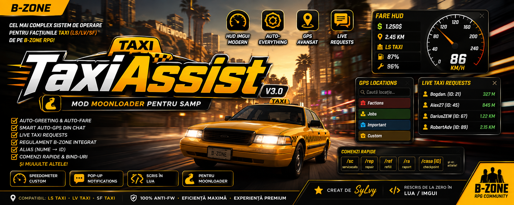
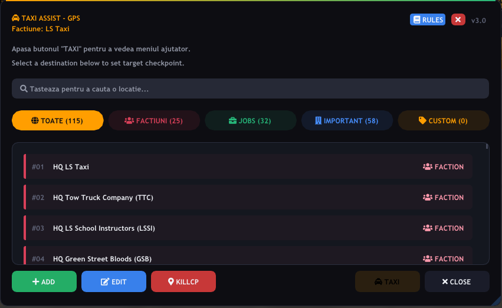
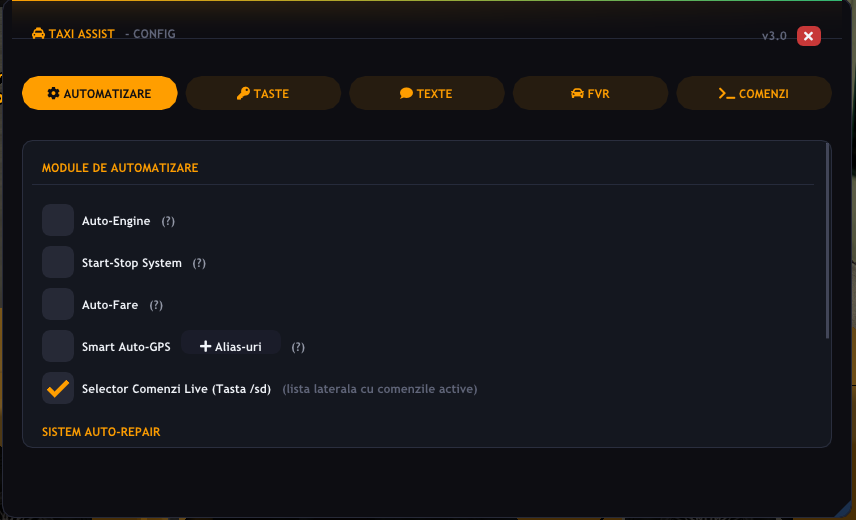
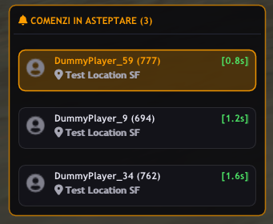
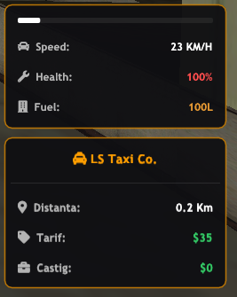
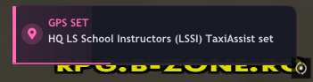
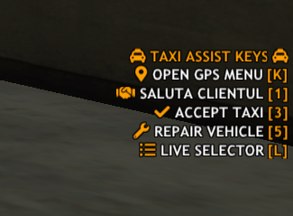

  
  
  # 🚖 B-Zone TaxiAssist v3.0
  **Cel mai complex script pentru facțiunile Taxi de pe `RPG.B-ZONE.RO`.**
  
  
  
  

---

**TaxiAssist** este un mod complex (scris în Lua pentru Moonloader) dedicat exclusiv membrilor facțiunilor Taxi de pe  `RPG.B-ZONE.RO`. Modul a fost conceput pentru a automatiza sarcinile repetitive, a aduna toate informațiile vitale într-un singur loc și a-ți oferi un avantaj major prin HUD-uri live, scurtături și sisteme de monitorizare pe ecran.

---

## 🗺️ 1. Meniul Principal (GPS & Rules) - Totul la un click distanță

Fereastra principală a modului (accesată prin `/txc` sau `/taxiassist`) revoluționează modul în care navighezi și accesezi informațiile pe server.

  

* **Locațiile Obligatorii Centralizate**: Nu mai e nevoie să cauți disperat pe forum sau să memorezi locații. Absolut toate locațiile de care ai nevoie sunt integrate aici, sortate vizual în categorii (Facțiuni, Joburi, Important, Custom).
* **Căutare Instantanee**: Bara de căutare filtrează în timp real locațiile pe măsură ce tastezi.
* **Adăugare Custom**: Poți adăuga, edita și șterge oricând locațiile tale personale direct din acest meniu.
* **Butonul "RULES" (Regulamentul)**: Da, până și regulamentul serverului/facțiunii este prezent! Apăsând pe butonul RULES, ai acces imediat la regulament pentru a rezolva orice dubiu fără să faci Alt-Tab.

---

## ⚙️ 2. Meniul de Configurare (TAXI Menu)

Apasă butonul **TAXI** din colțul dreapta-jos al ferestrei GPS pentru a deschide **Meniul de Control**.

  

Acesta este "creierul" modului, împărțit în secțiuni logice:
* **Automatizare**: Activezi/Dezactivezi funcții precum Auto-Fare (setează `/fare` automat conform orei zi/noapte), Auto-Greeting, Auto-Goodbye.
* **Texte (Custom Greetings)**: Te-ai săturat de textele clasice? Aici poți scrie propriile tale texte custom cu care modul să salute clienții sau să-și ia la revedere.
* **Comenzi (Help)**: O listă completă și explicată cu absolut toate comenzile scurte pe care le oferă modul. Ai uitat ce face o scurtătură? Verifici aici direct în joc.
* **Taste (Keybinds)**: Configurează butoanele rapide. Modul îți va afișa discret pe ecran scurtăturile tale (ex: *TAXI ASSIST KEYS: Open GPS Menu [K], Live Selector [L]*).

---

## 📱 3. Live Requests (Comenzi în așteptare)

Fii primul care ajunge la client cu sistemul **Live Requests** afișat permanent pe ecran!

  

* Modul interceptează automat absolut toți jucătorii care cheamă un taxi și îi pune într-o listă inteligentă.
* **Distanța și Timpul Exact**: Vezi numele, ID-ul, locația exactă cerută, timpul scurs de la cerere și distanța estimată până la jucător. Nu mai e nevoie să spamezi `/servicecalls` manual.
* *(Notă: Dacă apare o eroare de chat sau spam masiv, poți folosi comanda `/clearlive` doar pentru a curăța lista afișată, pentru un reset rapid).*

---

## 🏎️ 4. Fare HUD, Speedometer & Notificări

Modernizează-ți complet interfața de condus cu elemente ImGui. Aceste elemente pot fi **dezactivate sau activate oricând** din meniul TaxiAssist.

  

* **Speedometer Minimalist**: Îți arată Viteza (KM/H), Viața mașinii (%) și nivelul de Benzină. Arată excelent și nu încurcă vederea.
* **Fare HUD**: Se activează automat când urcă un client. Monitorizezi pe ecran:
  * Numele companiei tale (Personalizat LS/LV/SF)
  * Distanța cursei în timp real
  * Tariful curent aplicat
  * Câștigul exact din acea cursă

  

* **Notificări Pop-up Animate**: Acestea apar discret în colțul din dreapta-jos al ecranului (similar notificărilor Windows) însoțite de un sunet, informându-te despre diverse evenimente:
  * Când ți se setează un GPS automat
  * Când salvezi cu succes niște setări
  * Alerte referitoare la starea mașinii sau acțiuni executate cu succes

---

## ⌨️ 5. Keybinds (Taste Rapide pe Ecran)

Când ești la volan, nu ai timp să scrii comenzi lungi. Modul îți pune la dispoziție taste rapide care sunt afișate discret pe ecran pentru a nu le uita niciodată.

  

* **Unde le vezi**: Pe partea dreaptă a ecranului (sub radar/HUD) vei avea o listă transparentă "TAXI ASSIST KEYS" cu scurtăturile tale curente (ex: `Open GPS Menu [K]`, `Live Selector [L]`).
* **De unde se activează/schimbă**: Din **Meniul de Configurare (Butonul TAXI) -> Tab-ul "Taste"**. Aici poți asocia orice tastă dorești pentru:
  * Acceptarea rapidă a comenzii de Taxi (echivalent `/accept taxi [ID]`)
  * Acceptarea serviciului de Medic/Mecanic
  * Comanda rapidă de Repair (`/repair`)
  * Deschiderea meniului GPS

---

## 💬 6. Zeci de Scurtături și Comenzi (Shortcuts)

Pe lângă interfețe, ai cel mai complet set de comenzi scurte, concepute pentru aglomerația din trafic:

### Comenzi de navigare/sistem
| Comandă | Acțiune |
|---------|---------|
| `/txc` | Deschide fereastra principală a modului |
| `/selectfaction` | Schimbă culoarea modului conform facțiunii tale (LS/LV/SF) |
| `/alias` | Mapează un Nume pe un ID ca să-l poți folosi ușor în comenzi |
| `/casa [ID]`, `/biz [ID]`, `/clanhq [ID]` | Pune checkpoint instant pe harta ta la aceste locații |
| `/dd` sau `/kcp` | Șterge instant Checkpoint-ul de pe hartă (`/killcp` + `/cancel find`) |

### Scurtături Utile (Tastate)
Modul îți scurtează tastarea pentru 90% din acțiunile necesare:
| Tu scrii | Ce face modul |
|----------|---------------|
| `/sc` | `/servicecalls` |
| `/rep` | `/repair` (Trece automat pe jobul de mecanic dacă e nevoie) |
| `/ref` | `/refill` |
| `/ra` | `/raport` |
| `/ej [ID]` | `/eject [ID]` |
| `/cch` | Curăță chat-ul (Clear Chat) doar pe ecranul tău, ca să scapi de spam |

### Mesaje Rapide Pentru Clienți
| Tu scrii | Mesaj trimis automat pe chat |
|----------|------------------------------|
| `/iau` | *(Pe chatul facțiunii /tx)*: "Preluat!" |
| `/aj` / `/amj` | "Am ajuns la destinatia dorita." / "Taxiul solicitat a ajuns." |
| `/radio` | "Dorești un post de radio anume? Daca da, care?" |
| `/refuz` | "Te rog sa dai /cancel taxi, am alta comanda." |
| `/reper` | "Imi poti da un reper mai exact, te rog?" |
| `/limbaj` | "Pastreaza un limbaj decent sau primesti eject!" |

---

## 🤫 7. ...Și Multe Altele de Descoperit

Lista de mai sus acoperă doar ce e mai esențial. Modul este complet cu zeci de funcții mici menite să te ajute la raport, sisteme de detectare și mici detalii pe care te lăsăm să le descoperi singur. Aștept totuși sugestii dacă mai aveți idei ce să mai bag în mod pe discord: sylwy (am stat să mă gândesc cu ce pot face mai bun modul față de varianta cleo și am reușit :x, dar totuși cred că mai lipsește ceva).

---

## 📦 8. Instalare

1. Descarcă și instalează **CLEO**, **SAMPFUNCS** și **Moonloader 0.26** în folderul jocului.
2. Descarcă modul cu tot cu librăriile necesare și moonloader de [aici](https://drive.google.com/file/d/1fqqceeMieJwpnf5UvxLjDWqbYLpEqNCC/view?usp=drive_link)
3. Extrage tot în folderul principal al jocului (acolo unde se află și **gta_sa.exe**). 
4. Intră pe server și scrie comanda **/start** pentru a începe configurarea modului.

---

## 👨‍💻 9. Credits
Modul ăsta a fost transcris de la vechiul Taxi Helper care a fost scriptat în CLEO de **TheTom** și **florynn_fly**, iar cu ajutorul Gemini & Claude am reușit să fac acest mod ajutător posibil.

## 🎮 10. Enjoy!

Dacă vă place și vă ajută, lăsați un ⭐ **Star** pe GitHub!
